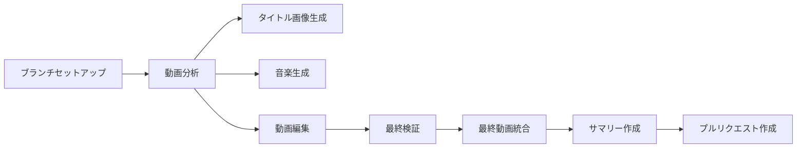

# Video Text Enhancer Workflow

> このプロジェクトは [KentaHomma/kamuicode-workflow](https://github.com/KentaHomma/kamuicode-workflow) のフォークとして作成されました。

> このワークフロー・README.mdとSETUP.mdは、上記のリポジトリを基に作成させて頂いております。
> オリジナルのワークフローを公開してくださった [@KentaHomma](https://github.com/KentaHomma) さんに心より感謝申し上げます。


動画にAIが生成したタイトルと説明文を追加し、タイトル背景画像と音楽も生成して統合するGitHub Actionsワークフローです。

## 主な機能

- 🎬 **動画分析**: Google Gemini Vision APIを使用して動画内容を分析
- 📝 **説明文生成**: 動画の重要なポイントに説明テキストを自動生成
- 🎨 **タイトル生成**: 動画内容に基づいたタイトルを自動生成（カスタマイズも可能）
- 🖼️ **タイトル背景画像生成**: AI（Imagen4）によるタイトル画面用の背景画像生成
- 🎵 **背景音楽生成**: AI（Google Lyria）による動画全体の背景音楽生成
- ✅ **品質検証**: 生成されたコンテンツの整合性を自動チェック

## 現状のワークフローの流れ



## 必要な設定

### 1. リポジトリシークレット

以下のシークレットをGitHubリポジトリに設定してください：

- `GEMINI_API_KEY`: Google Gemini APIキー（必須）
- `PAT_TOKEN`: GitHub Personal Access Token（PRの自動作成に必要、オプション）

⚠️ **重要**: AI画像・音楽生成機能を使用するには`.gemini/settings.json`の設定が必要です。  
詳細な設定方法は[SETUP.md](SETUP.md)を参照してください。

### 2. ディレクトリ構造

このリポジトリをクローン後：
```
kamuicode-workflow-video-description/
├── video-text-enhancer.yml    # ワークフローファイル
├── scripts/
│   ├── analyze_video.py      # 動画分析スクリプト
│   └── verify_content.py     # コンテンツ検証スクリプト
├── videos/
│   └── README.md             # 動画ディレクトリの説明
├── README.md
├── SETUP.md
└── LICENSE
```

自分のリポジトリで使用する場合：
```
your-repository/
├── .github/
│   └── workflows/
│       └── video-text-enhancer.yml
├── scripts/
│   ├── analyze_video.py
│   └── verify_content.py
└── videos/
    └── your-video.mp4
```

## 使用方法

### このリポジトリをクローンして使用

1. **リポジトリのクローン**
   ```bash
   git clone https://github.com/kousunh/kamuicode-workflow-video-description.git
   cd kamuicode-workflow-video-description
   ```

2. **ワークフローの設定**
   ```bash
   # .github/workflowsディレクトリを作成
   mkdir -p .github/workflows
   # ワークフローファイルをコピー
   cp video-text-enhancer.yml .github/workflows/
   ```

3. **動画ファイルの追加**
   ```bash
   # 動画ファイルをvideosディレクトリに配置
   cp /path/to/your/video.mp4 videos/
   git add videos/
   git commit -m "Add video file"
   git push origin main
   ```

4. **ワークフローの実行**
   - GitHubリポジトリの「Actions」タブを開く
   - 「Video Text Enhancer」ワークフローを選択
   - 「Run workflow」をクリック
   - 必要に応じてパラメータを入力

## 入力パラメータ

| パラメータ | 説明 | 必須 | デフォルト |
|---------|------|-----|----------|
| `video_path` | 分析対象の動画ファイルパス | ✅ | `auto-select` |
| `edit_title` | カスタムタイトル（省略時は自動生成） | ❌ | - |
| `description_prompt` | 説明文生成時の追加指示 | ❌ | - |

### video_pathの特殊値
- `auto-select`: videosディレクトリ内の最新の動画を自動選択

## 生成される成果物

ワークフロー実行後、以下のディレクトリ構造が作成されます：

```
movie-edit-YYYYMMDD-HHMMSS/
├── analysis/
│   ├── title.json          # タイトル設定
│   ├── descriptions.json   # 説明文リスト
│   ├── text-position.json  # テキスト表示位置
│   └── summary.md         # 分析レポート
├── edited-movie/
│   ├── basic-edited.mp4   # 基本編集版
│   ├── [元ファイル名]-final-edited.mp4  # 最終版
│   └── report.md          # 編集レポート
├── title-image/
│   └── background.jpg     # AI生成タイトル背景画像
├── music/
│   └── background.wav     # AI生成音楽
├── verification/
│   ├── final-check.json   # 検証結果
│   └── report.md          # 検証レポート
└── README.md              # 処理サマリー
```

## 処理フロー

1. **動画分析**: Gemini Vision APIで動画を分析し、タイトルと説明文を生成
2. **基本編集**: FFmpegでタイトル画面と説明文オーバーレイを追加
3. **タイトル背景画像生成**: タイトル画面用のAI背景画像を生成
4. **背景音楽生成**: 動画内容に基づいた背景音楽を生成
5. **最終検証**: 生成されたコンテンツの整合性をチェック
6. **統合**: 全要素を組み合わせて最終版を作成
7. **PR作成**: 処理結果を含むプルリクエストを自動作成

## カスタマイズ

### フォント設定
ワークフロー内の`FONT_FILE`環境変数でフォントファイルを指定できます：
```yaml
env:
  FONT_FILE: "/usr/share/fonts/opentype/noto/NotoSansCJK-Regular.ttc"
```

### テキストスタイル
`analyze_video.py`内の`TITLE_STYLE`定数で調整できます：
```python
TITLE_STYLE = {
    "fontsize": 72,
    "color": "white",
    "bgcolor": "black@0.8",
    "fontfile": "/usr/share/fonts/opentype/noto/NotoSansCJK-Regular.ttc"
}
```

## 注意事項

- 大きな動画ファイル（50MB以上）は処理に時間がかかります
- 日本語テキストの表示には適切なフォントが必要です
- GitHub Actionsの実行時間制限（6時間）に注意してください

## トラブルシューティング

### ワークフローが実行されない
- `workflow_dispatch`イベントなので、手動実行が必要です
- Actionsタブから手動で実行してください

### 文字化けする
- 日本語フォントがインストールされているか確認
- `fonts-noto-cjk`パッケージがインストールされます

## フィードバック

ワークフローに問題があればissueなど頂けるとありがたいです。

## 改変・利用について

このワークフローには実用面での改善の余地がまだ多くあります。自由に改変していただき、有用な部分があればぜひご活用ください。

## 検討課題

以下は私が検討している改善点の一例です。

### テキスト表示のカスタマイズ
現在、テキストの表示設定（フォント、サイズ、フェード効果、表示位置など）はコード内のFFmpegパラメータで制御しています。これらの設定は用途に応じて、コードを直接編集することで自由にカスタマイズできます。

テキストの表示位置については、現在Gemini AIが動画内容を分析して最適な位置（左上・上・右上・左下・下・右下）を自動判定していますが、ユーザーが直接指定できるオプションを追加することで、より柔軟な運用が可能になるかもしれません。

### 成果物の管理方法
現在のワークフローでは、処理の途中経過を含むすべての成果物がブランチに保存される仕様になっています。ストレージの効率化を図るため、最終成果物のみを残し、中間ファイルを自動削除するのも検討していました。

### Claude Code SDKへの差し替え
KAMUICODEの画像生成や音楽生成部分はGemini CLI Actionを利用しているものの、Claude Code SDKに差し替えられます。

## ライセンス

このワークフローはMITライセンスで提供されます。