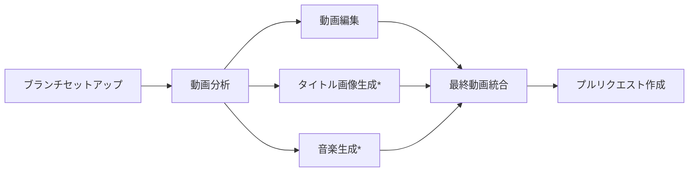
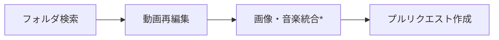

# Video Text Enhancer Workflow

> このプロジェクトは [KentaHomma/kamuicode-workflow](https://github.com/KentaHomma/kamuicode-workflow) のフォークとして作成されました。

> このワークフロー・README.mdとSETUP.mdは、上記のリポジトリを基に作成させて頂いております。
> オリジナルのワークフローを公開してくださった [@KentaHomma](https://github.com/KentaHomma) さんに心より感謝申し上げます。


動画にAIが生成したタイトルと説明文を追加し、タイトル背景画像と音楽も生成して統合するGitHub Actionsワークフローです。

## 主な機能

- 🎬 **動画分析**: Google Gemini Vision APIを使用して動画内容を分析
- 📝 **説明文生成**: 動画の重要なポイントに説明テキストを自動生成
- 🎨 **タイトル生成**: 動画内容に基づいたタイトルを自動生成（カスタマイズも可能）
- 🖼️ **タイトル背景画像生成**: AI（Imagen4）によるタイトル画面用の背景画像生成
- 🎵 **背景音楽生成**: AI（Google Lyria）による動画全体の背景音楽生成
- ✅ **品質検証**: 生成されたコンテンツの整合性を自動チェック

## 現状のワークフローの流れ



*オプション機能（有効/無効を選択可能）

## 必要な設定

### 1. リポジトリシークレット

以下のシークレットをGitHubリポジトリに設定してください：

- `GEMINI_API_KEY`: Google Gemini APIキー（必須）
- `PAT_TOKEN`: GitHub Personal Access Token（PRの自動作成に必要、オプション）

⚠️ **重要**: AI画像・音楽生成機能を使用するには`.gemini/settings.json`の設定が必要です。  
詳細な設定方法は[SETUP.md](SETUP.md)を参照してください。

### 2. ディレクトリ構造

このリポジトリをクローン後：
```
kamuicode-workflow-video-description/
├── video-text-enhancer.yml    # ワークフローファイル
├── scripts/
│   ├── analyze_video.py      # 動画分析スクリプト
│   └── verify_content.py     # コンテンツ検証スクリプト
├── videos/
│   └── README.md             # 動画ディレクトリの説明
├── README.md
├── SETUP.md
└── LICENSE
```

自分のリポジトリで使用する場合：
```
your-repository/
├── .github/
│   └── workflows/
│       └── video-text-enhancer.yml
├── scripts/
│   ├── analyze_video.py
│   └── verify_content.py
└── videos/
    └── your-video.mp4
```

## 使用方法

### このリポジトリをクローンして使用

1. **リポジトリのクローン**
   ```bash
   git clone https://github.com/kousunh/kamuicode-workflow-video-description.git
   cd kamuicode-workflow-video-description
   ```

2. **ワークフローの設定**
   ```bash
   # .github/workflowsディレクトリを作成
   mkdir -p .github/workflows
   # ワークフローファイルをコピー
   cp video-text-enhancer.yml .github/workflows/
   ```

3. **動画ファイルの追加**
   ```bash
   # 動画ファイルをvideosディレクトリに配置
   cp /path/to/your/video.mp4 videos/
   git add videos/
   git commit -m "Add video file"
   git push origin main
   ```

4. **ワークフローの実行**
   - GitHubリポジトリの「Actions」タブを開く
   - 「Video Text Enhancer」ワークフローを選択
   - 「Run workflow」をクリック
   - 必要に応じてパラメータを入力

## 入力パラメータ

| パラメータ | 説明 | 必須 | デフォルト |
|---------|------|-----|----------|
| `video_path` | 分析対象の動画ファイルパス | ✅ | `auto-select` |
| `edit_title` | カスタムタイトル（省略時は自動生成） | ❌ | - |
| `description_prompt` | 説明文生成時の追加指示 | ❌ | - |
| `text_position` | テキストの表示位置 | ❌ | `auto` |
| `generate_title_image` | AI背景画像を生成してタイトル画面に使用 | ❌ | `true` |
| `generate_background_music` | AI背景音楽を生成して追加 | ❌ | `true` |

### video_pathの特殊値
- `auto-select`: videosディレクトリ内の最新の動画を自動選択

### text_positionの選択肢
- `auto`: 自動選択（デフォルト）
- `左上`、`上`、`右上`、`左下`、`下`、`右下`: 指定位置に表示

## 生成される成果物

ワークフロー実行後、以下のディレクトリ構造が作成されます：

```
movie-edit-YYYYMMDD-HHMMSS/
├── analysis/
│   ├── title.json          # タイトル設定
│   ├── descriptions.json   # 説明文リスト
│   ├── text-position.json  # テキスト表示位置
│   └── summary.md         # 分析レポート
├── work-in-progress/
│   ├── title.mp4          # タイトル動画
│   ├── video_with_overlays.mp4  # テキストオーバーレイ追加版
│   ├── basic-edited.mp4   # 基本編集版（タイトル＋本編）
│   └── report.md          # 編集レポート
├── final-output/
│   └── [元ファイル名]-final-edited.mp4  # 最終版
├── title-image/            # （オプション）
│   └── background.jpg     # AI生成タイトル背景画像
├── music/                  # （オプション）
│   └── background.wav     # AI生成音楽
└── README.md              # 処理サマリー
```

## 処理フロー

1. **動画分析**: Gemini Vision APIで動画を分析し、タイトルと説明文を生成
2. **基本編集**: FFmpegでタイトル画面と説明文オーバーレイを追加
3. **拡張機能（オプション）**:
   - **タイトル背景画像生成**: AI（Imagen4）でタイトル画面用の背景画像を生成
   - **背景音楽生成**: AI（Google Lyria）で動画内容に基づいた背景音楽を生成
4. **最終統合**: 選択された要素を組み合わせて最終版を作成
5. **PR作成**: 処理結果を含むプルリクエストを自動作成

## Re-Edit Video ワークフロー

既存の編集済み動画を再編集するためのワークフローです。`video-text-enhancer.yml`で生成されたブランチ内のフォルダにある分析結果（analysis/）、タイトル画像（title-image/）、背景音楽（music/）を活用して、最終動画を再編集できます。

### ワークフローの流れ



*タイトル画像・背景音楽の追加時のみ実行

### 機能
- 既存のmovie-editフォルダから動画を検出
- mainブランチで見つからない場合は最新のvideo-editブランチを自動検索
- テキスト位置の変更（default、左上、上、右上、左下、下、右下）
- 既存のタイトル画像・音楽アセットを使用した統合

### 使用方法

1. **Actions タブから実行**
   - 「Re-Edit Existing Video」を選択
   - 「Run workflow」をクリック
   - **重要**: ワークフロー実行時に必ず編集したいブランチを選択してください
   - mainブランチで実行した場合は、video-editフォルダのタイムスタンプが一番新しいフォルダを編集します

2. **入力パラメータ**
   - `text_position`: テキストの表示位置を変更（デフォルト: default）
   - `add_title_image`: 既存のタイトル画像を使用（チェックボックス）
   - `add_background_music`: 既存の背景音楽を使用（チェックボックス）

3. **動作**
   - 最新のmovie-editフォルダを自動検出
   - アセットの存在を確認し、利用可能なものだけを統合
   - チェックボックスがオフの場合はテキストオーバーレイのみ

## カスタマイズ

### タイトル・説明テキストの設定
タイトルや説明テキストのスタイル（フォントサイズ、色、背景色など）は、settingsディレクトリで管理されています。
詳細は[settings/ffmpeg-settings-readme.md](settings/ffmpeg-settings-readme.md)を参照してください。

### プロンプトの設定
動画分析やAI生成に使用するプロンプトも、settingsディレクトリで管理されています：
- **動画分析プロンプト**: `settings/video-analysis-prompts.md`
- **画像生成プロンプト**: `settings/image-generation-prompt.md`
- **音楽生成プロンプト**: `settings/music-generation-prompt.md`

これらのファイルを編集することで、AI生成の挙動をカスタマイズできます。

## 注意事項

- 日本語テキストの表示には適切なフォントが必要です
- 動画ファイルサイズに注意してください（GitHubの最大ファイルサイズは100MB）
- **重要**: `video-text-enhancer.yml`で出力された成果品の一部を削除・リネームすると、Re-Edit Videoワークフローが動かなくなる可能性があります
- 自分のタイトル画像や音楽を使用したい場合は、同じ名前（`title-image/background.jpg`、`music/background.wav`）で差し替えてください

## トラブルシューティング

### ワークフローが実行されない
- `workflow_dispatch`イベントなので、手動実行が必要です
- Actionsタブから手動で実行してください

### 画像・音楽が生成されない
- ワークフローの画像・音楽生成ジョブの詳細ログを確認してください
- Gemini CLI Actionのレートリミットで止まっている可能性があります
- GitHub Secretsの`T2I_FAL_IMAGEN4_FAST_URL`と`T2M_GOOGLE_LYRIA_URL`が正しく設定されているか確認してください

## ワークフローの動作モード

### 基本モード（高速処理）
AI生成機能を無効にすることで、動画分析と基本編集のみを実行：
- `generate_title_image`: `false`
- `generate_background_music`: `false`

### フルモード（全機能）
すべての機能を有効にして、AI生成コンテンツを含む高品質な動画を作成：
- `generate_title_image`: `true`（デフォルト）
- `generate_background_music`: `true`（デフォルト）

## フィードバック

ワークフローが途中で止まる、挙動がおかしいなど、気づいた点がございましたら是非issueなど頂きたいです。

## ライセンス

このワークフローはMITライセンスで提供されます。